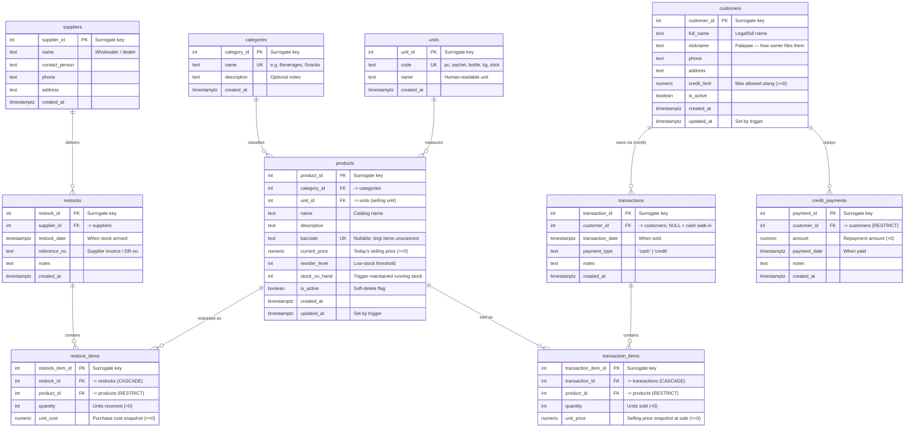

# Entity Relationship Diagram — Digital Sari-Sari Store

This diagram reflects [`schema.sql`](./schema.sql) exactly: 10 tables normalized to **Third
Normal Form (3NF)**. Two many-to-many relationships are resolved through associative
("line item") tables:

- **Products ↔ Restocks** is resolved by `restock_items`.
- **Products ↔ Transactions** is resolved by `transaction_items`.

The "utang" (credit) ledger is a *running-balance* model: a charge is simply a
`transactions` row with `payment_type = 'credit'`, and `credit_payments` records money coming
back. Current balances are computed (not stored) by the `v_customer_balances` and
`v_utang_ledger` views.

> `schema.sql` is DDL-only; the ~676,767-row dataset (specific Filipino brands across six
> product groups) is generated by the Python pipeline and bulk-loaded. See [`README.md`](./README.md).

> PK = Primary Key · FK = Foreign Key · UK = Unique Key

## Cardinality summary

| Relationship                                   | Type | Meaning                                                        |
|------------------------------------------------|------|---------------------------------------------------------------|
| categories → products                          | 1:N  | A category groups many products; a product has one category.  |
| units → products                               | 1:N  | A selling unit applies to many products.                      |
| suppliers → restocks                           | 1:N  | A supplier delivers many restock events.                      |
| restocks → restock_items                       | 1:N  | A restock has many lines (CASCADE on delete).                 |
| products → restock_items                       | 1:N  | A product appears on many restock lines.                      |
| customers → transactions                       | 1:N  | A customer has many (credit) sales; cash sales have no customer. |
| transactions → transaction_items               | 1:N  | A sale has many lines (CASCADE on delete).                    |
| products → transaction_items                   | 1:N  | A product appears on many sale lines.                         |
| customers → credit_payments                    | 1:N  | A customer makes many utang repayments.                       |

## Derived views (not tables)

| View                  | Purpose                                                                 |
|-----------------------|-------------------------------------------------------------------------|
| `v_product_stock`     | Per-product stock: strictly-derived `on_hand` next to trigger-maintained `maintained_on_hand` (reconciliation). |
| `v_customer_balances` | Running utang balance per customer: `SUM(credit sales) − SUM(payments)`. |
| `v_utang_ledger`      | Unified per-customer timeline of charges & payments with a running balance — the digital page of the old notebook. |
